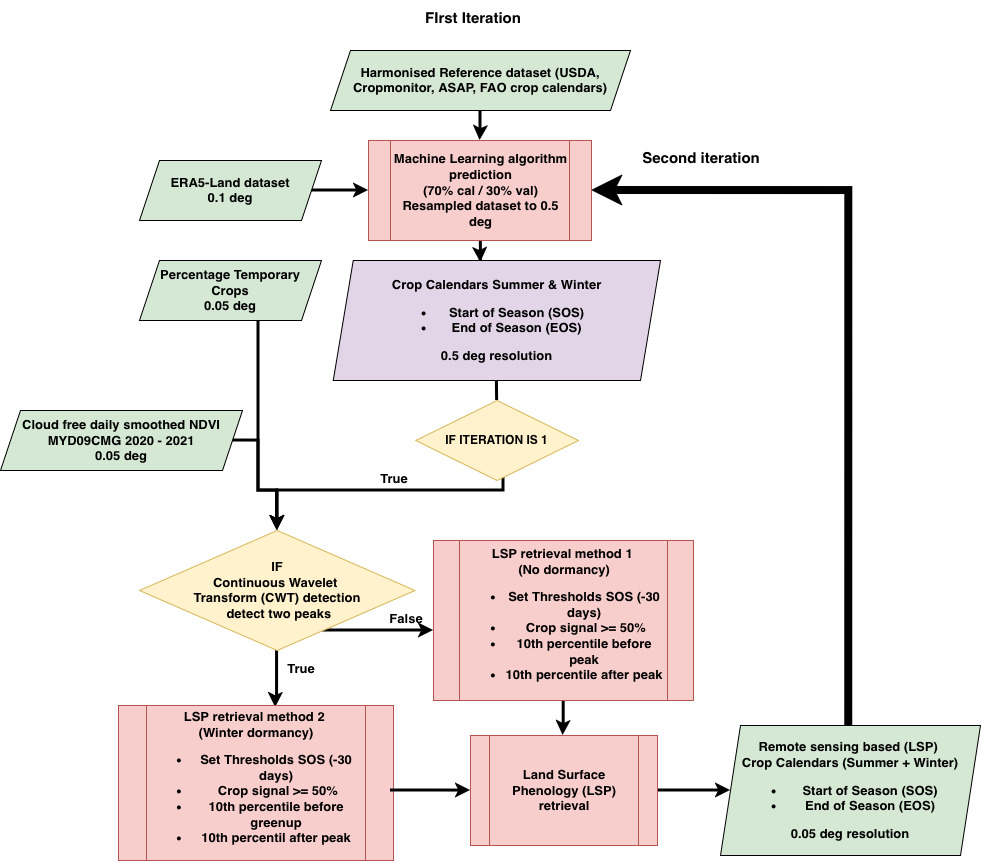
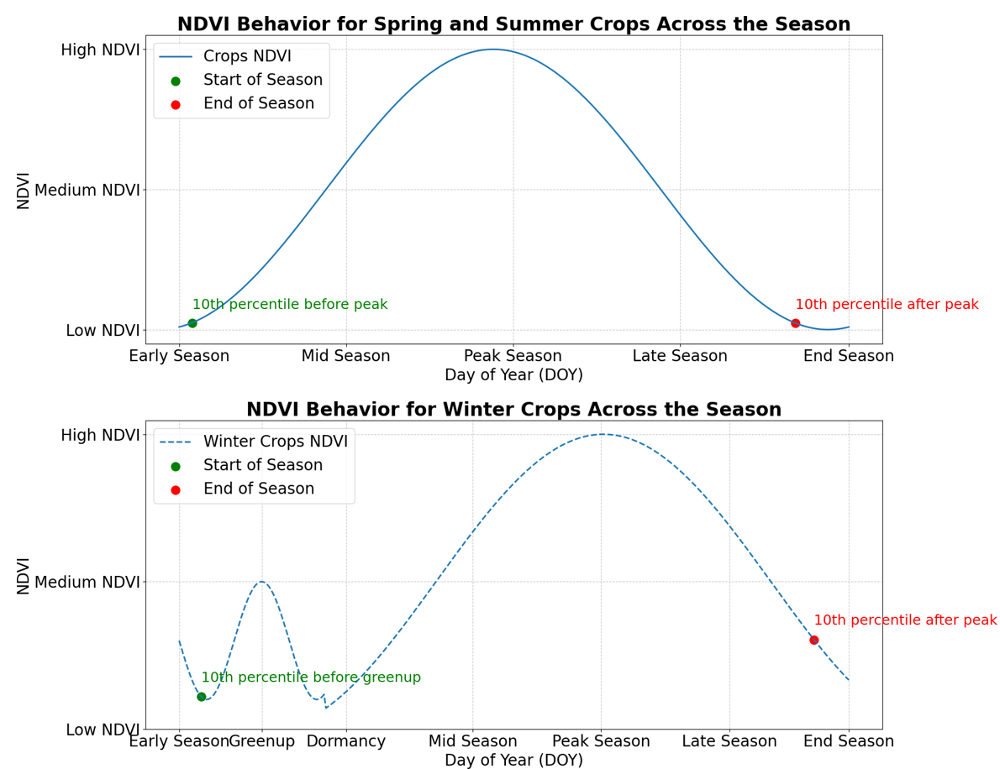
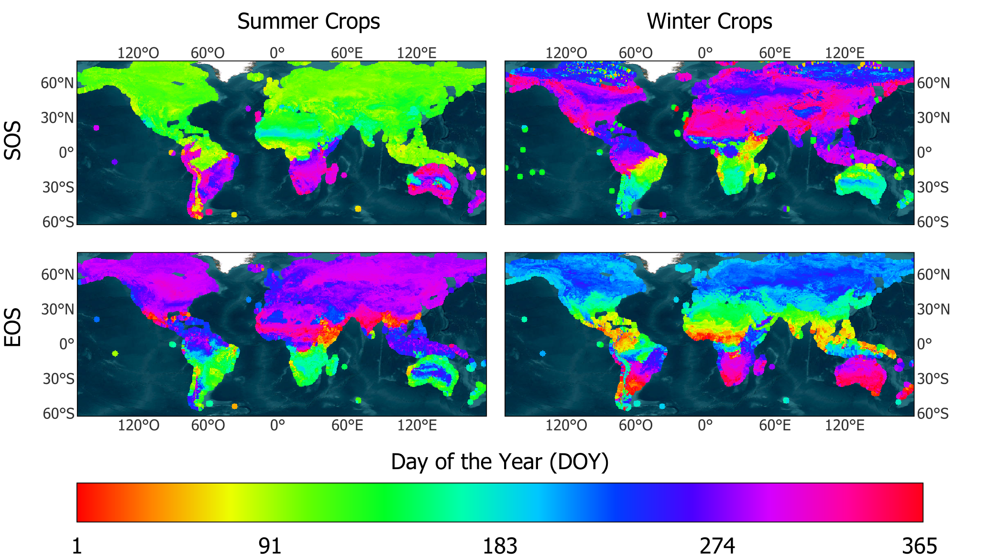

# Technical Methodology

The WorldCereal crop calendars are generated using a two-stage modeling framework that combines climate data with remote sensing-derived phenology.

## Workflow Overview
The following flowchart illustrates the integration of reference data, satellite-derived phenology (LSP), and climate information through a synergistic machine learning approach.

*Flowchart of the methodology applied for global crop calendar retrieval.*

## 1. Data Smoothing (HANTS)
To handle cloud contamination and noise in the MODIS NDVI time series, we use the **Harmonic Analysis of Time Series (HANTS)** algorithm. This ensures a clean phenological signal for extracting Start of Season (SOS) and End of Season (EOS).

*Concept of NDVI for summer and winter crops, highlighting key phenological metrics and dormancy detection.*

## 2. Machine Learning (XGBoost)
The core of the system is an **XGBoost** (Extreme Gradient Boosting) model. This algorithm was selected after benchmarking against several other models due to its superior performance in capturing non-linear relationships between climate variables and crop cycles.

### Key Predictors:
- **Climate (ERA5-Land)**: Temperature, precipitation, and dewpoint averages.
- **Geography**: Latitude and spatial centroids.
- **Phenology**: LSP-derived metrics from smoothed NDVI.

## 3. Dormancy Modeling
A unique feature of Phase II is the explicit representation of **winter dormancy**. By identifying the "post-dormancy green-up" as the true Start of Season for winter cereals, we avoid systematic errors in high-latitude regions that were present in earlier versions.

## 4. Global Results
The final output is a spatially continuous 0.5° grid providing SOS and EOS for every crop-producing pixel globally.

*Global distribution of SOS and EOS for summer and winter crops.*
