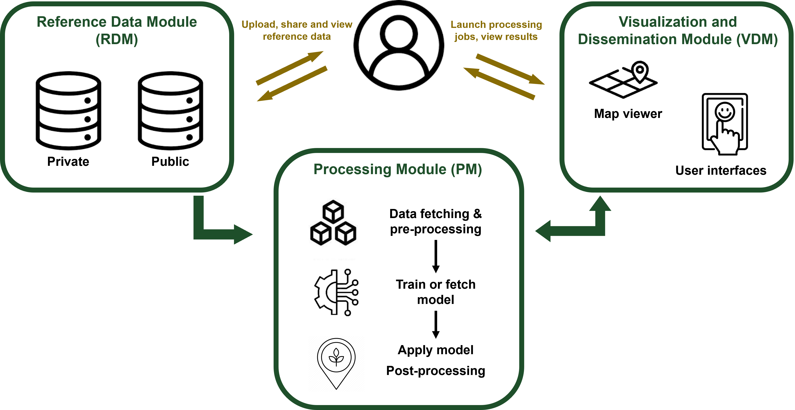

# An overview of the WorldCereal system

## Conceptual design of the system

The WorldCereal system is designed to guarantee the cost-efficient production of land cover and crop type products at local, regional and global scale. 
It is composed of three main modules, as illustrated in the Figure below:  

- [**Reference Data Module (RDM)**](../rdm/overview.md) 
Hosting harmonized in-situ reference data & metadata - aiming at supporting a cooperative approach of sharing reference data relevant for crop monitoring. Data shared by the user can either remain private, be shared with the WorldCereal consortium or made fully publicly available.  
- [**Processing Module (PM)**](../processing/overview.md) 
Includes all the workflows that allow the training and application of classification algorithms based on Earth Observation and ancillary data sources. This typically includes data fetching, pre-processing, feature computation, classification model training, inference and post-processing.  
- [**Visualization & Dissemination Module (VDM)**](../vdm/overview.md) 
Developed as an interactive web-based platform based on open-source components letting users generate and explore WorldCereal products.  

The interfaces between the modules are based on API for flexibility and efficiency reasons.

Users can interact with the system either through the RDM, for visualizing or contributing reference data, or through the VDM, to launch processing jobs or visualize global WorldCereal products. 

*Please note that the Processing Module is currently not accessible through the VDM. More information on how to use the Processing Module can be found on its dedicated set of pages.*

<figcaption>*High-level overview of the different modules of the WorldCereal processing system and how they are interlinked.*</figcaption>

## Current features of the WorldCereal system

*Status 17/10/2024 - First official release*

[Reference Data Module](../rdm/overview.md)

- Explore and download harmonized in-situ reference data
- Upload and harmonize your own in-situ reference data

[Processing Module](../processing/overview.md)

- Generate a cropland extent map using our pre-trained cropland model for your area and year of interest
- Train and apply a custom cropland classification model for your area and year of interest
- Train and apply a custom crop type classificaiton model for your area, season and crop types of interest

[Visualizaton and Dissemination Module](../vdm/overview.md)

- Explore the global WorldCereal products for 2021
- Consult country statistics based on the global products

## Planned features of the WorldCereal system

### Reference Data Module

- Increased guidance of the user to publish private datasets (share with either the WorldCereal consortium or with the whole community).

### Processing Module

- Ability to use uploaded in-situ reference data to train your custom models.
- The default cropland model will continuously be updated, based on new training data being added to the system.
- Also the construction of default crop type models is ongoing.

### Visualization and Dissemination Module

- User interface that allows you to download (parts of) the global WorldCereal products.
- User interface that allows you to launch a training or inference run in the Processing Module.