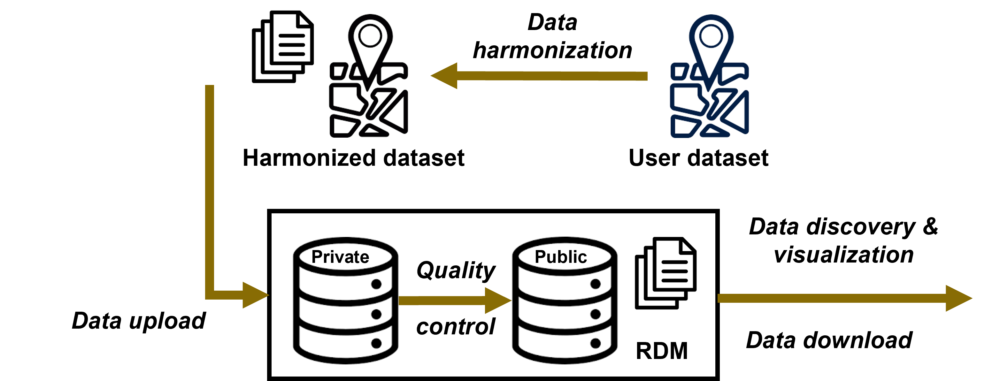

# Reference Data Module: overview

Availability of high-quality in-situ reference data remains one of the few bottlenecks for training and validating accurate cropland/crop type classification models. The [WorldCereal Reference Data Module (RDM)](https://rdm.esa-worldcereal.org/) is an online application hosting harmonized reference datasets on land cover and crop type. Through the RDM, users can **view, query, download, contribute, share and publish crop reference data.** All this functionality is available through an intuitive user interface and a more advanced API service.

<figcaption>Visual representation of how in-situ reference data travels through the RDM.</figcaption>

## Harmonized crop reference data

The RDM hosts datasets from various providers with standardized metadata and attributes mapped to a unified crop type legend. Built-in automated data quality checks and careful curation performed by WorldCereal data moderators ensure high and transparent data quality. 

--> [**Discover more about the WorldCereal standards and harmonization procedures**](./refdata.md)

## Data exploration and access

Reference datasets are either harmonized and uploaded by the WorldCereal consortium or contributed by our users. 
Each dataset is characterized by a specific **data privacy level**:

- **Private** (default for user datasets): only the owner of the data can view and use the data.
- **Restricted**: the owner and WorldCereal consortium members are able to view and use the data.
- **Public**: everyone can view and use the data in accordance with the specified data license.

A handful of convenient tools, both through web interface and API service, are available to our users to efficiently filter, query and download reference data matching their needs.

--> [**Read more on data privacy and exploration**](./explore.md)

## Data contribution and upload

By contributing reference data, users can:
- use their private data in combination with publicly available reference data to train specific crop classifiers and generate fully customized crop maps 
- (if shared with WorldCereal consortium) help improve global WorldCereal models and get acknowledged for their contribution

Our highly automated upload procedure through our web interface takes care of data harmonization to the WorldCereal standards, thereby effectively taking away most of the burden from the user.

--> [**Explore more details and instructions on uploading data to the RDM**](./upload.md)

## Data publication

Once data has been uploaded, users can choose to share the data openly with the community according to a specified data license. 
Upon publication, additional quality control is performed by the WorldCereal data moderators.

--> [**Read more on how to share your data with others**](./publish.md)

 
Through this initiative the WorldCereal consortium aims to foster open data sharing within the agricultural monitoring community.

<figcaption>Generic framework on in-situ reference data employed in WorldCereal.</figcaption>

More information on this framework in: 
*Boogaard, H., Pratihast, A.K., Laso Bayas, J.C., Karanam, S., Fritz, S., Van Tricht, K., Degerickx, J. and Gilliams, S., 2023. Building a community-based open harmonised reference data repository for global crop mapping. Plos one, 18(7), p.e0287731.*

## Citation of WorldCereal RDM

Please cite the WorldCereal Reference Data Module as follows:

*Karanam, S., Laso Bayas, J. C., Fritz, S., Boogaard, H., Pratihast, A. K., Degerickx, J., Butsko, C., Dries, J., & Van Tricht, K. (2024). WorldCereal Reference Data Module (RDM). International Institute for Applied Systems Analysis (IIASA). https://doi.org/10.60566/80p50-6z433*

## Contact and support

Need dedicated support on the topic of reference data or the WorldCereal Reference Data Module? 
Get in touch through the [dedicated section on our forum](https://forum.esa-worldcereal.org/c/ref-data/6).