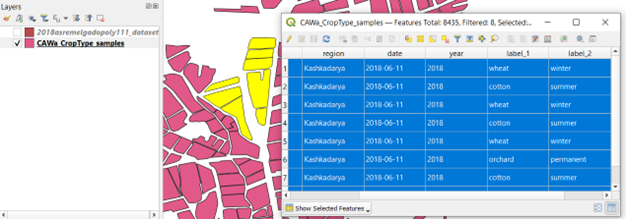
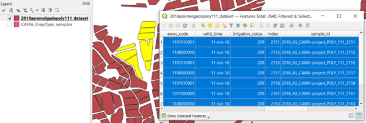

# In-situ reference data

## Definition & usage

We define reference data as all data which can either be used for calibrating the WorldCereal classification algorithms or validating the resulting WorldCereal products. As such, reference data should contain **location- and time-specific information about land cover and/or crop type**.  

Reference data can include: 
- in-situ field data gathered through dedicated field surveys 
- farmers declarations through parcel registration systems 
- data derived from visual or automated interpretation of very high resolution satellite imagery or in-situ photographs (e.g. streetview or mapillary) 
- existing high-quality classified maps based on analysis of satellite imagery 

## Harmonization

Reference data is typically available in different formats depending on the source of the dataset. To ensure multiple reference datasets can be readily combined and can serve as input for a dedicated calibration/validation task, all datasets entering the Reference Data Module should adhere to the same (meta)data standards and formats.  

In practice, this means: 
- Each dataset should be named according to a [**standardized naming convention**](#dataset-naming-convention), so the origin and contents of the dataset are immediately clear to the user.  
- Each dataset should be documented according to a **standardized metadata structure**, again to enable easy retrieval of information related to origin, history, content and access right of the data. To ensure maximum interoperability with other geospatial data portals and specifically allow easy data discovery, the STAC metadata format has been adopted to document each individual dataset. Click [**HERE**](https://rdm.esa-worldcereal.org/collections/2018_as_cawaproject_poly_111) to see an example of the type of metadata that is collected for each harmonized and publicly available dataset.   
- The land cover/crop type labels in each dataset should be defined according to the same [**generic and hierarchical land cover / crop type legend**](#hierarchical-land-covercrop-type-legend).  
- Each dataset should contain the same list of [**standardized data attributes**](#dataset-attributes) and each attribute should adhere to predefined formatting standards.  

To illustrate this harmonization procedure, the next two figures show a screenshot of a dataset (publicly available in the RDM):

**(a) Before harmonization**

**(b) After harmonization**

### Dataset naming convention

We use the geoparquet format to store harmonized reference datasets.

A reference dataset name is typically compiled of 5 elements: 

- **Year**: Primary year of the dataset (Example: 2020)  

- **Region**: Spatial extent covered by the dataset. 

In case of only one country: use [ISO 3166-1 alpha-3](https://en.wikipedia.org/wiki/ISO_3166-1_alpha-3) country codes. 
In case of larger regions: GO (Globe), AF (Africa), NA (North America), OC (Oceania), AN (Antarctica), AS (Asia), EU (Europe), SA (South America) 
(Example: NPL)  

- **Identifier**: Unique identifier for the dataset containing pointers to source and content. Should be a sequence of words connected by hyphens. (Example: VITO-Potato-survey)  

- **Data type**: Short string indicating the type of data. Can be either: 
POINT --> shapefile containing points 
POLY --> shapefile containing polygons 
MAP --> classified map (raster data)  

- **Information content**: 3-digit code indicating which type of information is included. 
First digit represents land cover, second represents crop type and third represents irrigation. 
0 means absent, 1 means present. 
Examples:  
'100' means only information on land cover available; 
'110' means both land cover and crop type information; 
'101' means both land cover and irrigation information  

### Hierarchical land cover/crop type legend

The central idea is to have a common, hierarchical legend for land cover/crop type. 

The WorldCereal system can support the mapping of any crop type of interest, which requires our legend to be both extensive and dynamic (i.e. allowing the addition of new crop types, as new data come in). The legend has also been built hierarchically, using multiple levels (land cover, crop group, crop type, etc.), as our crop type classification models will also be trained in a hierarchical way. 

Our legend has been based mainly on crop characteristics as can be observed by remote sensing and is inspired by the Hierarchical Crop and Agriculture Taxonomy [HCAT](https://www.researchsquare.com/article/rs-3725140/v1) legend as also adopted in the [EuroCrops initiative](https://zenodo.org/records/6868143) (an initiative aimed at harmonizing European parcel registration datasets). 

In conclusion, the proposed detailed, dynamic and hierarchical legend allows ample flexibility to the user of the system in terms of customized model training and application.

The current legend can be consulted through the following links: 
[**CSV version**](https://artifactory.vgt.vito.be/artifactory/auxdata-public/worldcereal//legend/WorldCereal_LC_CT_legend_latest.csv) 
[**PDF version**](https://artifactory.vgt.vito.be/artifactory/auxdata-public/worldcereal//legend/WorldCereal_LC_CT_legend_latest.pdf) 

### Irrigation status legend

Even though irrigation mapping will not be officially supported by the  WorldCereal system, many of the datasets currently present in the WorldCereal Refernece Data Module hold information on irrigation practices. As we would like to conserve this information as much as possible, taking into account potential future extensions of the system, we decided to keep the irrigation label as an optional data attribute. The same irrigation legend is adopted as was introduced during WorldCereal Phase I and can be consulted through [**this link**](https://artifactory.vgt.vito.be/artifactory/auxdata-public/worldcereal/legend/WorldCereal_IRR_legend_latest.pdf). 

### Dataset attributes

Each harmonized vector file contains the following data attributes: 

| Attrbute Name | Type | Required? | Example | Description |
| ------------- | --------------- | --------------- | --------------- |--------------- |
| sample_id | string | Yes | 2019_BEL_vito-potato_POINT_101-AABD23 | Unique ID for each individual sample. In order to guarantee ID uniqueness, this ID is typically composed by the name of the dataset, followed by a hyphen and a sample ID. |
| ewoc_code | int64 | Yes | 1111020036 | Land cover and crop type label according to the [hierarchical WorldCereal legend](https://artifactory.vgt.vito.be/artifactory/auxdata-public/worldcereal//legend/WorldCereal_LC_CT_legend_latest.csv). This label is composed of 5 numeric parts, put together in one number.  |
| valid_time | datetime (YYYY-MM-DD) | Yes | 2020-10-01 | A specific date for which the observation is valid. See [this document](https://rdm.esa-worldcereal.org/details/WorldCereal_DerivingValidityTime_v1_1.pdf) for more information. |
| irrigation_status | int32 | Yes | 213 | 3-digit code indicating presence and type of irrigation. See the [irrigation legend](https://artifactory.vgt.vito.be/artifactory/auxdata-public/worldcereal/legend/WorldCereal_IRR_legend_latest.pdf) for more information. |
| extract | int32 | Yes | 3 | In case of very large datasets, it is simply not feasible to use ALL samples for model training/validation, as for each sample the associated input data need to be fetched, which can become quite costly. Therefore, this attribute indicates whether or not for this sample an extraction of model inputs should be done. The higher the value, the more priority this sample has for launching the extractions pipeline. |
| quality_score_lc | int32 | No | 50 | A quality score ranging from 0 to 100 indicating the inherent quality of the sample with respect to its land cover label. See also [Confidence score calculations](https://rdm.esa-worldcereal.org/details/WorldCereal_ConfidenceScoreCalculations_v1_1.pdf) |
| quality_score_ct | int32 | No | 50 | A quality score ranging from 0 to 100 indicating the inherent quality of the sample with respect to its crop type label. See also [Confidence score calculations](https://rdm.esa-worldcereal.org/details/WorldCereal_ConfidenceScoreCalculations_v1_1.pdf)  |
| h3_l3_cell | string | No | 823967fffffffff | ID of the h3 cell (used for sub-sampling) at level 3 resolution.  |
| sampling_ewoc_code | int32 | No | 1111020036 | Crop category label assigned to the sample during sub-sampling of the dataset.  |
| image_time | datetime | No | 2020-10-01 (YYYY-MM-DD) | If dataset generated through interpretation of imagery: timing of the imagery used to identify land cover/crop type label.  |
| number_validations | int | No | 46 | If dataset generated through interpretation of imagery: number of people having reviewed this observation. |
| type_validation | string | No | Expert | If dataset generated through interpretation of imagery: type of validation used to determine land cover/crop type label (either Expert, NonExpert or Both)  |
| agreement | int | No | 5 | If dataset generated through interpretation of imagery: number of people agreeing  |
| disagreement | int | No | 2 | If dataset generated through interpretation of imagery: number of people disagreeing  |

## Harmonization in practice

To ensure this data standardization, harmonization and documentation is done in the same way for all datasets, a **semi-automated workflow** has been set up to guide the user through this process for each dataset. Learn more about how you can add your data to the RDM and get it harmonized almost entirely automatically through our user dedicated user interface --> [**HERE**](./upload.md).

