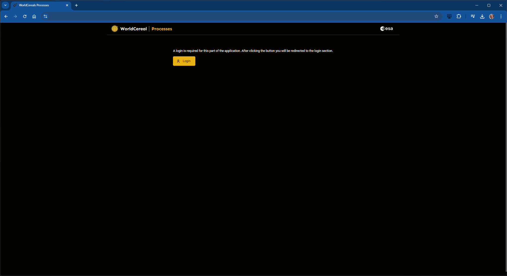
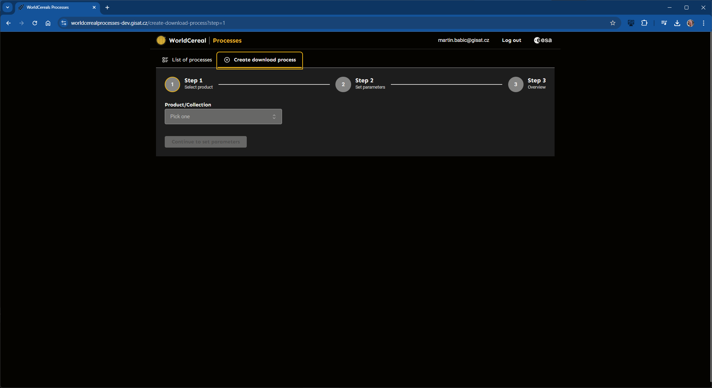
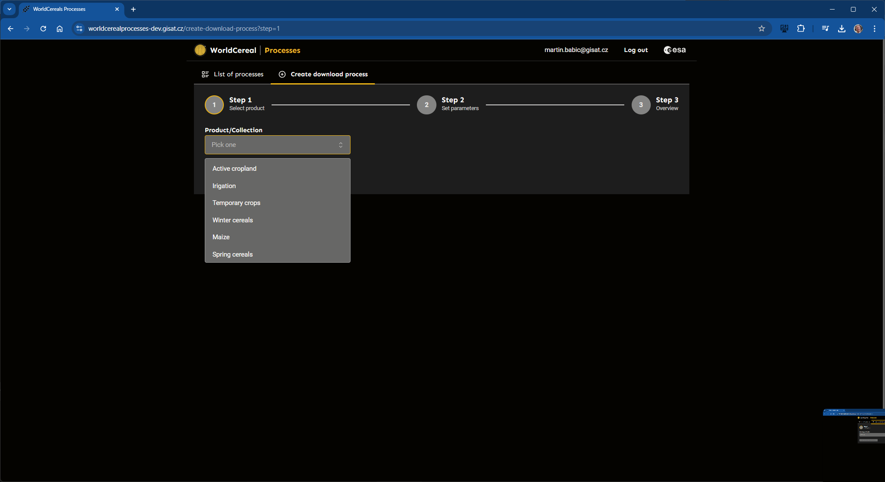
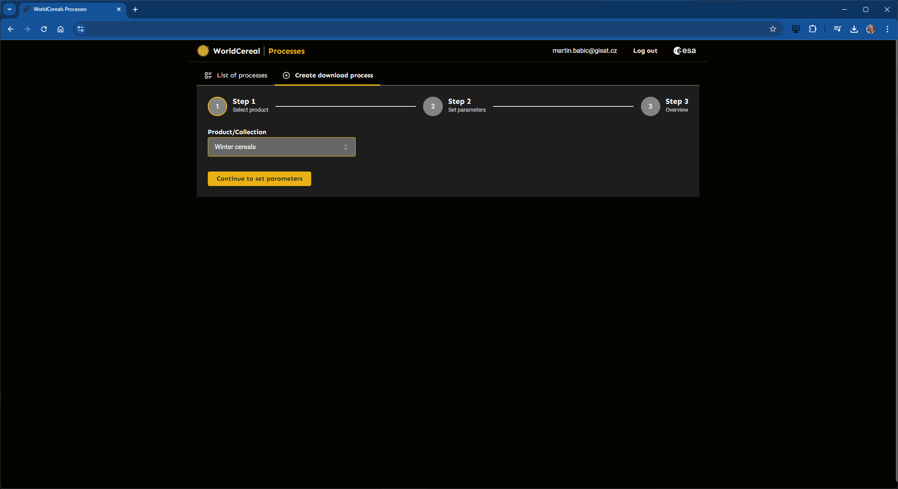
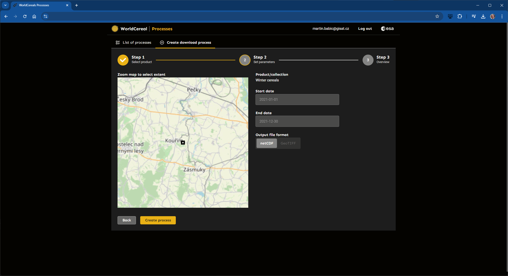
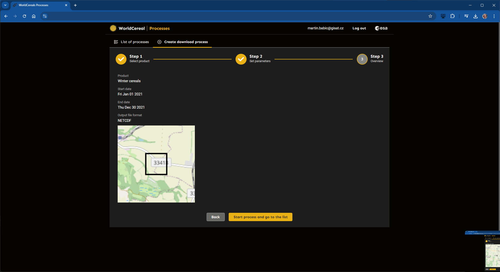
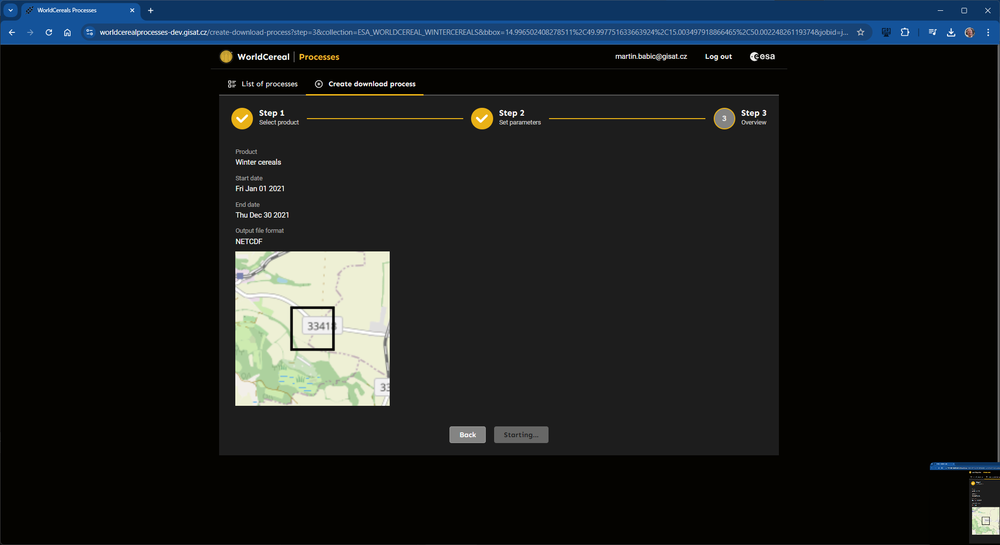
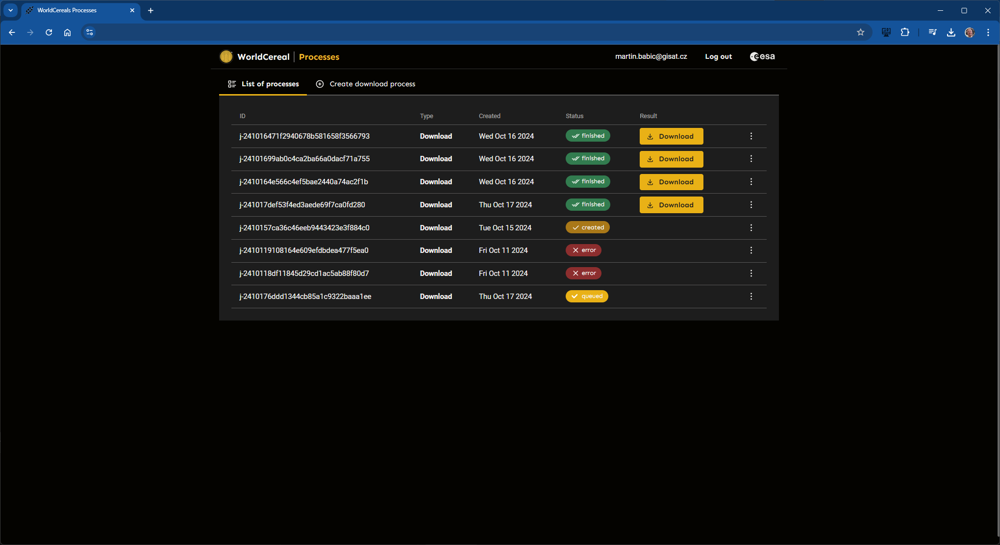

# Launching WorldCereal processing jobs through user interfaces

The Visualization and Disseminaton Module will host specific user interfaces allowing our users to launch their processing jobs with just a few clicks.

#### This feature is currently still under development...

# How to launch download job
## Login
To be able to use the tool, you need to login first.

## List of processes
Here you can find all your processes

## Creation of new process
### Step 1
On this page, you can create you new download process

As step one, select which product you want to download

confirm your selection and continue to next step

### Step 2
choose area of interest, set time range and output format and continue to next step

### Step 3
check if everything is correct...

and start your new download process

once, your download process is started, you will be redirected to list of processes, where you can monitor status of your new process

