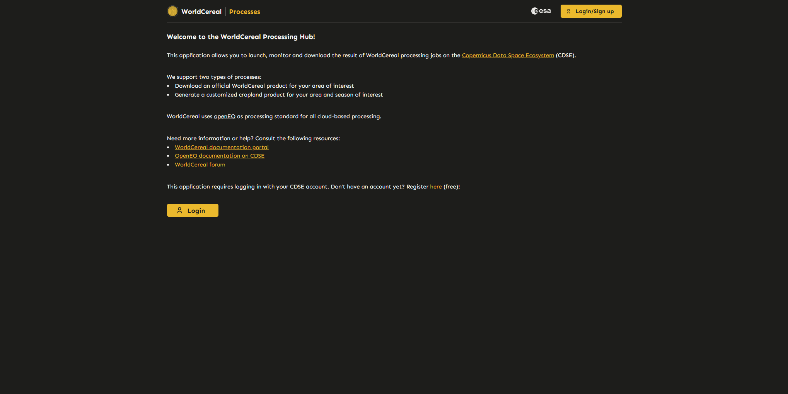
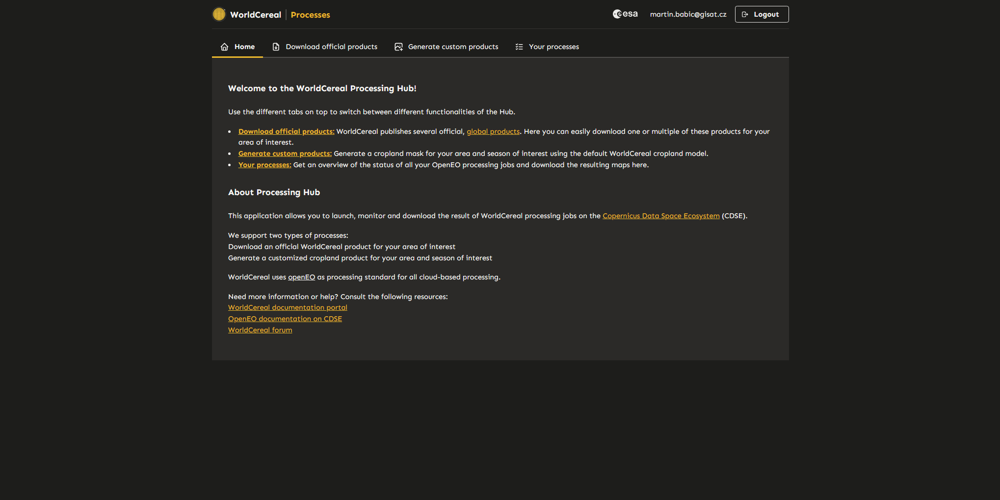
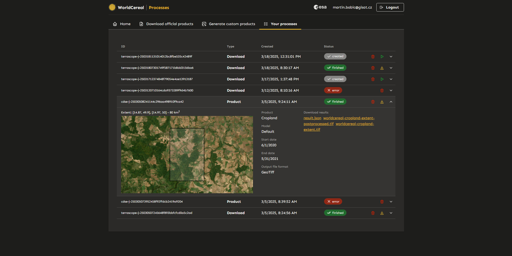
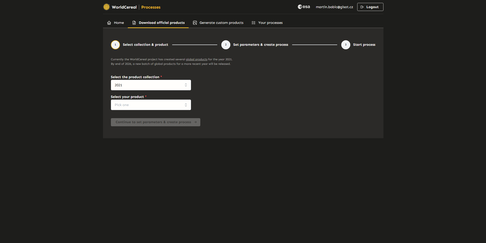
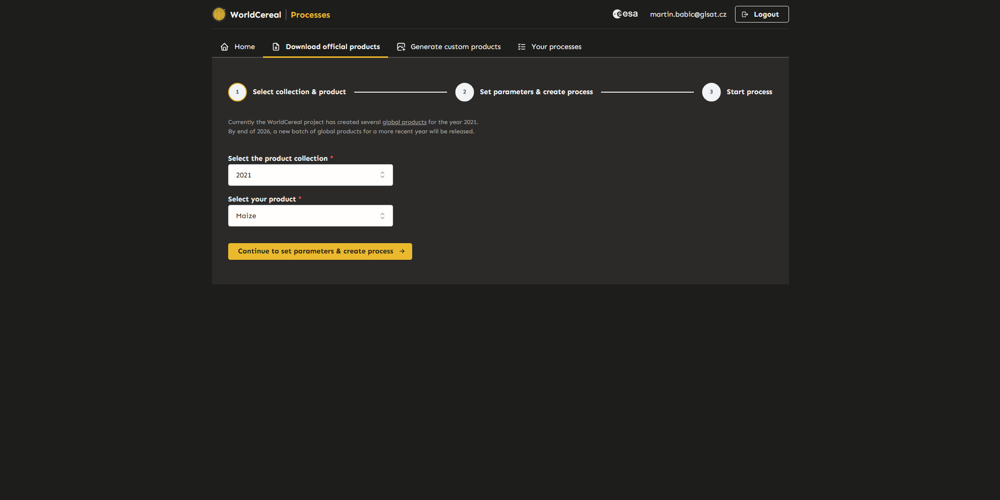
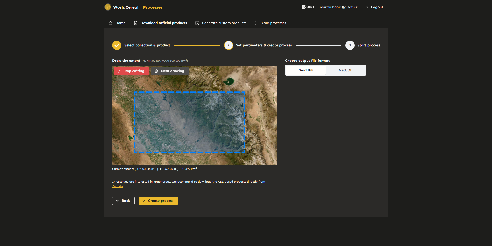
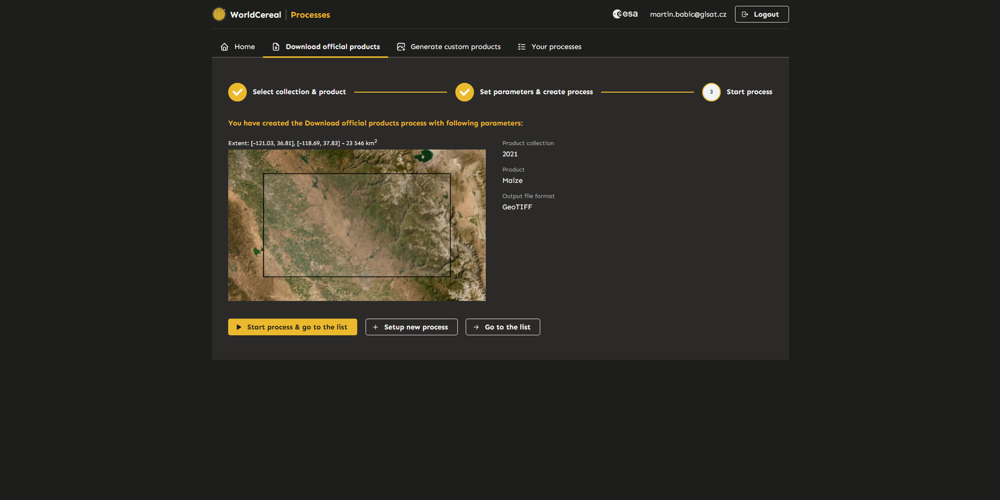
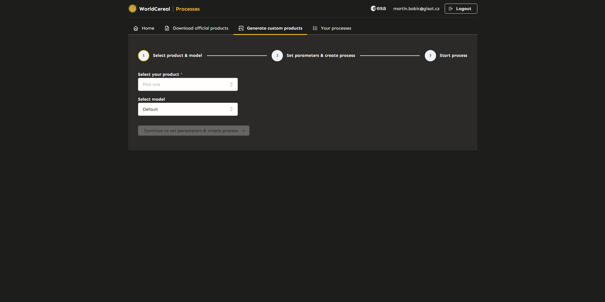
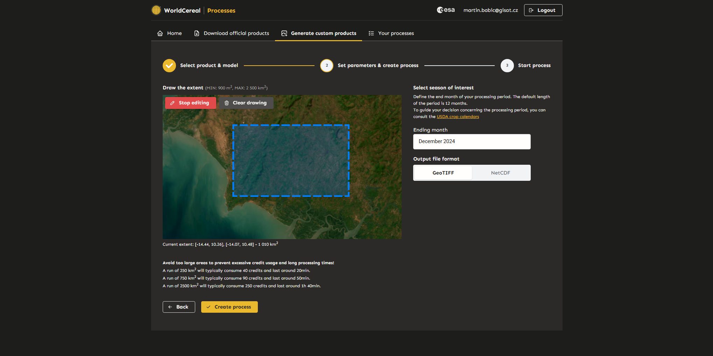
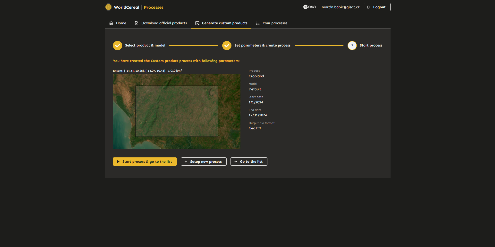

# Launching WorldCereal Processing Jobs Through User Interfaces

## Introduction
The [WorldCereal Processing Hub](https://hub.esa-worldcereal.org) provides user-friendly interfaces that enable users to launch and monitor WorldCereal processing jobs on the [Copernicus Data Space Ecosystem (CDSE)](https://dataspace.copernicus.eu/) with ease. 

We currently support two types of processes:

- Download an official WorldCereal product for your area of interest
- Generate a customized cropland product for your area and season of interest

The following sections provide a comprehensive walkthrough through the entire application.

---

## The WorldCereal Processing Hub

---

### Login
To access the tool, users must first log in using their CDSE account credentials. Once logged in, users will end up on the Home page of the application (next section).

---

### Home
The homepage provides basic information about the application and links to useful resources. The different components of the Processing Hub can be accessed through the different tabs at the top of the screen.

---

### List of Processes
The "List of Processes" page displays all active and completed processes along with their details (status, extent, input parameters, link to products). From here, you can download the individual results (maps) of your processing jobs directly to your computer by clicking the yellow links. In case you would like to consult detailed logs on a particular jobs, you can use the processing ID mentioned in the first column to locate the job directly in the [OpenEO web editor](https://openeo.dataspace.copernicus.eu/).

---

### Download Official Products

This section allows users to download [official global WorldCereal products](https://esa-worldcereal.org/en/products/global-maps) for their area of interest. Currently, official products are only available for the "2021" collection.

#### Step 1: Select Collection and Product
Select the desired collection and product, then proceed to the next step.

#### Step 2: Define Area of Interest and Output Format
Specify the area of interest (AOI) and output format, then create a new download process. Users can return to the previous step to modify their selection if needed. The download job will not start until it is confirmed in the next step.

*Note: There is a limit to the size of the area that can be selected. Current limits are displayed above the map window, and the size of the selected area is shown below the map window.*

#### Step 3: Confirm and Start the Process
Review the details of the process. If everything is correct, start the process. Once created, the user will be redirected to the "Your Processes" page. Additional processes can also be created and run later from the "Your Processes" tab.

---

### Generate Custom Products

This section allows users to generate and download custom WorldCereal classification products.

#### Step 1: Select Product Type and Model
Select the desired product type and model, then proceed to the next step.

*Note: Currently, only the "Default" model and "Cropland" product are available.*

#### Step 2: Define Parameters
Specify the area of interest (AOI), end month, and output format, then create a new custom product process. Users can return to the previous step to modify their selection if needed. The custom product process will not start until it is confirmed in the next step.

*Note: There is a limit to the size of the area that can be selected. Current limits are displayed above the map window, and the size of the selected area is shown below the map window. Additionally, examples are provided to indicate the estimated processing time and credit consumption for different AOI sizes.*

#### Step 3: Confirm and Start the Process
Review the details of the process. If everything is correct, start the process. Once created, the user will be redirected to the "Your Processes" page. Additional processes can also be created and run later from the "Your Processes" tab.

