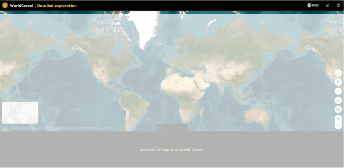
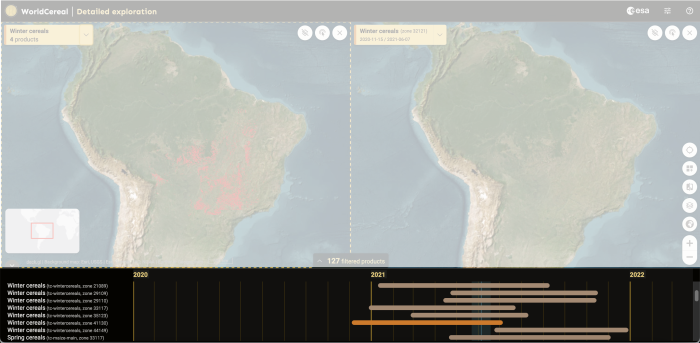
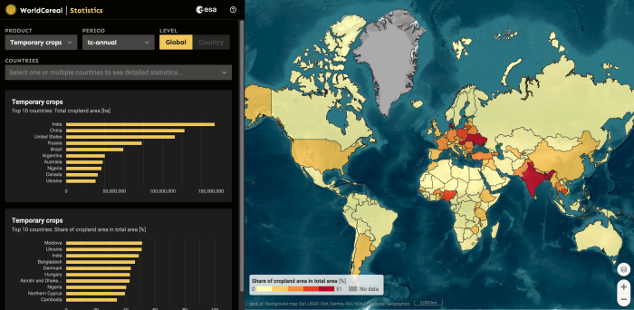
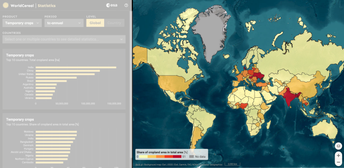
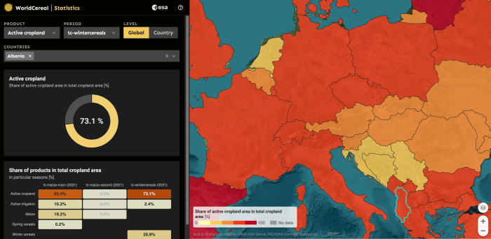

# How to use the VDM for product exploration?

  

Welcome to the **WorldCereal visualisation portal**. 
This guide will walk you through basic features and functions.

# Visualization templates

  

Access different visualisation templates by clicking on the appropriate tiles. 

**Detailed exploration** - Detailed exploration of individual WorldCereal products.

**Global view** - Global exploration of all WorldCereal products.

**Statistics** - Exploration of statistics derived from WorldCereal products.

# Detailed exploration

  

Explore all individual products based on Agro-Ecological Zones (AEZ) with this mapping template.

## Header

	

The header offers you basic navigation tools within the application. From left to right:

**Project Logo & Title** - Go back to the portal homepage.

**ESA Logo** - Link to the ESA home page.

**Configuration** - Open configuration panel for Map toolbar.

**Tour** - Start the application tour.

## Map window

	

**Map** - Main window to visualise WorldCereal products and supporting datasets.

**Product Tag** - Get the metadata information for the displayed product and define basic visualisation parameters.

**Minimap** - See the location of current Area of Interest (AOI) on the global map.

**Map toolbar** - Open tools for controlling the map window.

## Multiple map windows

	

Compare data from multiple maps side by side by opening multiple map windows and adding different products to each of them.

**Add map** - Opens a new map window.

**Compare** - Creates a slider between the map windows that enables comparison of the maps.

**Close** - Closes the map window.

## Active map window

	

To add products to the new map window, click on it first to make it active. Active maps are indicated by a yellow dashed border.

## Product timeline

	

Scroll through the list of products that overlap with the current Area of Interest (AOI) and add them to the map by clicking on the corresponding bar. 
Identify the Agro-Ecological Zone (AEZ) and the season to which each product belongs. 
Make a visual check of the duration of the season. 
With your mouse cursor in the bounds of the timeline, use the mouse wheel to zoom in and out.

## Filters

	

Select product categories and seasons to display in the timeline.

# Global view

  

Explore all WorldCereal products grouped by product categories and individual seasons using this mapping template.

# Statistics view

  

Analyze a range of statistics derived from WorldCereal products using this mapping template.

## Map window

	

The map window displays a map of administrative units (countries and regions) for which statistical figures are available. 
Click on the map to select a country or region. 
`Ctrl` + click to add more countries or regions to the comparison chart.

## Statistics panel

	

Define parameters and generate custom charts to present statistics derived from WorldCereal products.

**Product** - Select product for statistical exploration.

**Period** - Select period for statistical exploration.

**Level** - Switch between global and country level.

**Countries** - Select countries or regions for statistical exploration. Selected areas are highlighted in the map window.
